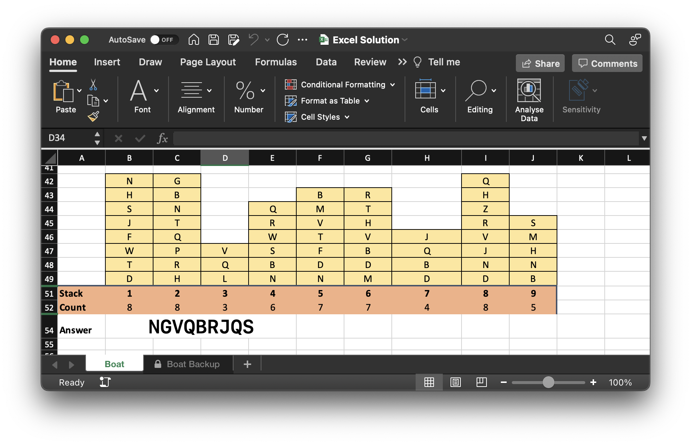

# Advent of Code 2022 - Day 05
## (Supply Stacks)

### `main1.py`
Fairly simple solution with poping and appending to lists to use the stacks, as stacks!

### `main2.py`
Again the same as before, but with some python list operations now 

### `main1excel.py`
Now using `pynput`to simulate keyboard and mouse presses to move creates from one row to another in excel.

You can change the delay for each key press by modifiying the value of `t` for the function `dt(...)`

Who said you can't do everything in excel?

| dt() | Runtime |
|------|---------|
| 0.1s | 1h 20m  |

